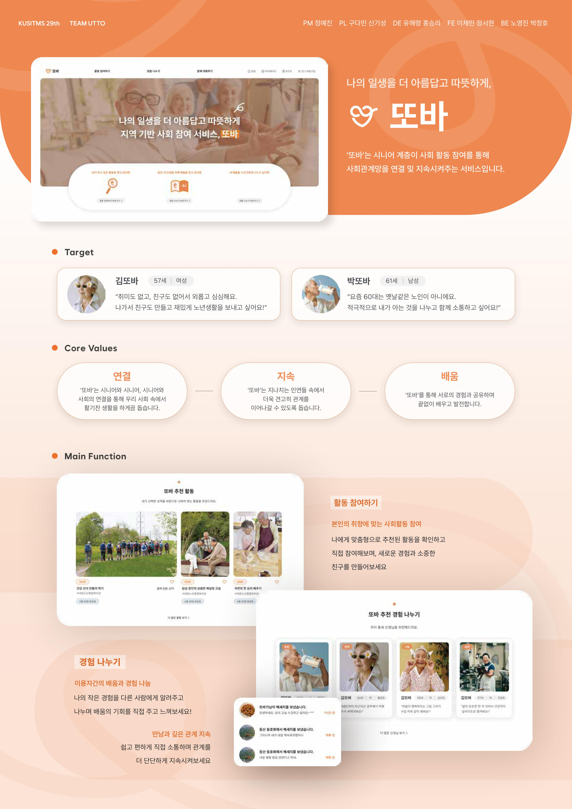

<div align="center">

<!-- ✅ 상단: "글자 자체가 춤추는" SVG(배경 어둡게 + 텍스트 흰색) -->
<!-- TODO: 문구/속도/폰트/배경색 원하는대로 수정 -->
<svg xmlns='http://www.w3.org/2000/svg' width='1200' height='220' viewBox='0 0 1200 220'>  <defs>    <linearGradient id='bg' x1='0' y1='0' x2='1' y2='1'>      <stop offset='0' stop-color='%230b1020'/>      <stop offset='1' stop-color='%23010b18'/>    </linearGradient>    <filter id='glow'>      <feGaussianBlur stdDeviation='2.2' result='coloredBlur'/>      <feMerge>        <feMergeNode in='coloredBlur'/>        <feMergeNode in='SourceGraphic'/>      </feMerge>    </filter>  </defs>  <rect width='1200' height='220' rx='26' fill='url(%23bg)'/>  <text x='60' y='140' font-family='Inter, Segoe UI, Arial' font-weight='900' font-size='92' fill='white' filter='url(%23glow)'>    <tspan>      <tspan dx='0'>S</tspan>      <tspan dx='0'>u</tspan>      <tspan dx='0'>b</tspan>      <tspan dx='0'>e</tspan>      <tspan dx='0'>e</tspan>      <tspan dx='0'>s</tspan>    </tspan>  </text>  <!-- 각 글자를 독립적으로 흔들리게(춤추는 느낌) -->  <g font-family='Inter, Segoe UI, Arial' font-weight='900' font-size='92' fill='white' opacity='0'>    <!-- 접근성용: 위 text가 보임. 아래는 애니메이션용(겹쳐서 같은 위치에 다시 렌더) -->  </g>  <g font-family='Inter, Segoe UI, Arial' font-weight='900' font-size='92' fill='white' filter='url(%23glow)'>    <text x='60' y='140'>      <tspan id='c1'>S</tspan>      <animateTransform attributeName='transform' type='translate' additive='sum' dur='1.35s' repeatCount='indefinite' values='0 0; 0 -10; 0 0; 0 6; 0 0'/>    </text>    <text x='120' y='140'>      <tspan>u</tspan>      <animateTransform attributeName='transform' type='translate' additive='sum' dur='1.15s' repeatCount='indefinite' values='0 0; 0 8; 0 0; 0 -7; 0 0'/>    </text>    <text x='182' y='140'>      <tspan>b</tspan>      <animateTransform attributeName='transform' type='translate' additive='sum' dur='1.42s' repeatCount='indefinite' values='0 0; 0 -8; 0 0; 0 9; 0 0'/>    </text>    <text x='246' y='140'>      <tspan>e</tspan>      <animateTransform attributeName='transform' type='translate' additive='sum' dur='1.22s' repeatCount='indefinite' values='0 0; 0 10; 0 0; 0 -6; 0 0'/>    </text>    <text x='306' y='140'>      <tspan>e</tspan>      <animateTransform attributeName='transform' type='translate' additive='sum' dur='1.30s' repeatCount='indefinite' values='0 0; 0 -9; 0 0; 0 7; 0 0'/>    </text>    <text x='366' y='140'>      <tspan>s</tspan>      <animateTransform attributeName='transform' type='translate' additive='sum' dur='1.18s' repeatCount='indefinite' values='0 0; 0 7; 0 0; 0 -9; 0 0'/>    </text>  </g>  <text x='62' y='190' font-family='Inter, Segoe UI, Arial' font-weight='600' font-size='22' fill='%23e5e7eb' opacity='0.95'>Unified Subscription Manager · Front-end</text></svg>"
  alt="Subees Dancing Title"
/>


<!-- ✅ 로고 (프로젝트에 포함된 이미지 경로로 연결) -->

<br/>
<sub><b>Subees Logo</b></sub>


<!-- ✅ (선택) 대표 이미지 자리 -->
<!-- TODO: 아래 이미지 경로를 실제 파일로 교체 -->

<br />
<sub><b>Project Cover / Main Screenshot</b></sub>

<br /><br />

<!-- 배지(원하는대로 수정) -->


</div>

---

## 👥 Team (Subees)

<!-- TODO: 역할/파트/담당 기능은 추후 수정 -->
| Avatar | Name | Role | GitHub |
|---|---|---|---|
|  | 김가영 | 조장 | https://github.com/ZonezIpex |
|  | 김다솜 | 팀원 | https://github.com/ZonezIpex |
|  | 김승욱 | 팀원 | https://github.com/ZonezIpex |
|  | 김정수 | 팀원 | https://github.com/ZonezIpex |
|  | 신민수 | 팀원 | https://github.com/ZonezIpex |
|  | 이서윤 | 팀원 | https://github.com/ZonezIpex |

---


## 👀 Repository 목차
1. [📌 프로젝트 개요 (Project Overview)](#프로젝트-개요-project-overview)
2. [🧠 프로젝트 선정 이유 및 기대 효과](#프로젝트-선정-이유-및-기대-효과)
3. [🗺️ 사용자 시나리오 (User Scenario) 및 프로세스 맵](#사용자-시나리오-및-프로세스-맵)
4. [🧰 기술 스택 (Tech Stack)](#기술-스택-tech-stack)
5. [🧩 Framework & Language](#framework--language)
6. [🔁 상태 관리 및 통신 라이브러리](#상태-관리-및-통신-라이브러리)
7. [🎨 UI 라이브러리 및 디자인 도구](#ui-라이브러리-및-디자인-도구)
8. [🏗️ 설계 및 구조 (Design & Architecture)](#설계-및-구조-design--architecture)
9. [🖼️ 화면 및 기능 설계서 (Figma 상세 링크)](#화면-및-기능-설계서-figma)
10. [🧩 유스케이스 다이어그램 (Use Case Diagram)](#유스케이스-다이어그램-use-case-diagram)
11. [🧱 컴포넌트 계층 구조 및 폴더 구조 (Atomic Design 등)](#컴포넌트-계층-구조-및-폴더-구조)
12. [🧪 단위 테스트 및 시연 (UI/UX Unit Test)](#단위-테스트-및-시연-uiux-unit-test)
13. [🎞️ 기능별 시연 GIF (모듈별)](#기능별-시연-gif)
14. [📊 UI/UX 단위 테스트 결과서 (Spreadsheet 링크)](#uiux-단위-테스트-결과서-spreadsheet)
15. [🧭 브라우저 호환성 및 반응형 대응 현황](#브라우저-호환성-및-반응형-대응-현황)
16. [📌 개발 관리 및 회고 (Project Management)](#개발-관리-및-회고-project-management)
17. [📅 WBS 기반 일정 관리 현황](#wbs-기반-일정-관리-현황)
18. [🚀 향후 개선 및 확장 방안](#향후-개선-및-확장-방안)
19. [📝 팀원별 회고록 및 트러블슈팅](#팀원별-회고록-및-트러블슈팅)

---

<a id="프로젝트-개요-project-overview"></a>
## 📌 프로젝트 개요 (Project Overview)

### 1) 서비스 명칭 및 한 줄 소개
- **서비스 명칭:** Subees
- **한 줄 소개:** <!-- TODO -->

### 2) 프로젝트 범위(Front-end)
- 본 레포는 **Front-end(UI/UX)** 구현을 담당합니다.
- 주요 범위: 인증/구독관리/알림/대시보드/마이페이지 등

> <!-- TODO: 핵심 가치/문제정의/해결 전략 3~5줄 -->

---

<a id="프로젝트-선정-이유-및-기대-효과"></a>
## 🧠 프로젝트 선정 이유 및 기대 효과
- **선정 이유**
  - <!-- TODO -->
- **기대 효과**
  - <!-- TODO -->

---

<a id="사용자-시나리오-및-프로세스-맵"></a>
## 🗺️ 사용자 시나리오 및 프로세스 맵
- <!-- TODO: 시나리오 2~3개 작성 -->

<div align="center">


</div>

---

<a id="기술-스택-tech-stack"></a>
## 🧰 기술 스택 (Tech Stack)

| 분류 | 기술 |
|---|---|
| Framework | <!-- TODO: React/Next 등 --> |
| Language | <!-- TODO: TypeScript --> |
| Styling | <!-- TODO: Tailwind 등 --> |
| State/Data | <!-- TODO: TanStack Query/Zustand 등 --> |
| Test | <!-- TODO: Vitest/Jest/Playwright 등 --> |
| Design | <!-- TODO: Figma --> |

---

<a id="framework--language"></a>
## 🧩 Framework & Language
- Framework: <!-- TODO -->
- Language: <!-- TODO -->

---

<a id="상태-관리-및-통신-라이브러리"></a>
## 🔁 상태 관리 및 통신 라이브러리
- 상태 관리: <!-- TODO -->
- 통신: <!-- TODO -->

---

<a id="ui-라이브러리-및-디자인-도구"></a>
## 🎨 UI 라이브러리 및 디자인 도구
- UI: <!-- TODO -->
- Design: <!-- TODO -->

---

<a id="설계-및-구조-design--architecture"></a>
## 🏗️ 설계 및 구조 (Design & Architecture)
- 설계 원칙: <!-- TODO -->

<div align="center">


</div>

---

<a id="화면-및-기능-설계서-figma"></a>
## 🖼️ 화면 및 기능 설계서 (Figma 상세 링크)
🔗 <!-- TODO: Figma 링크 -->

---

<a id="유스케이스-다이어그램-use-case-diagram"></a>
## 🧩 유스케이스 다이어그램 (Use Case Diagram)

<div align="center">


</div>

---

<a id="컴포넌트-계층-구조-및-폴더-구조"></a>
## 🧱 컴포넌트 계층 구조 및 폴더 구조

```txt
src/
  app/
  components/
  features/
  services/
  stores/
  hooks/
  styles/
  utils/
  types/
  assets/
```

<!-- TODO: 실제 프로젝트 구조로 수정 -->

---

<a id="단위-테스트-및-시연-uiux-unit-test"></a>
## 🧪 단위 테스트 및 시연 (UI/UX Unit Test)
- 전략: <!-- TODO -->

```bash
# TODO: 실제 명령어로 교체
pnpm test
pnpm e2e
```

---

<a id="기능별-시연-gif"></a>
## 🎞️ 기능별 시연 GIF

<div align="center">


</div>

---

<a id="uiux-단위-테스트-결과서-spreadsheet"></a>
## 📊 UI/UX 단위 테스트 결과서 (Spreadsheet 링크)
🔗 <!-- TODO: 스프레드시트 링크 -->

<div align="center">


</div>

---

<a id="브라우저-호환성-및-반응형-대응-현황"></a>
## 🧭 브라우저 호환성 및 반응형 대응 현황
- <!-- TODO -->

---

<a id="개발-관리-및-회고-project-management"></a>
## 📌 개발 관리 및 회고 (Project Management)
- <!-- TODO -->

---

<a id="wbs-기반-일정-관리-현황"></a>
## 📅 WBS 기반 일정 관리 현황
🔗 <!-- TODO: WBS 링크 -->

<div align="center">


</div>

---

<a id="향후-개선-및-확장-방안"></a>
## 🚀 향후 개선 및 확장 방안
- <!-- TODO -->

---

<a id="팀원별-회고록-및-트러블슈팅"></a>
## 📝 팀원별 회고록 및 트러블슈팅
- 회고: <!-- TODO -->
- 트러블슈팅: <!-- TODO -->

---

## 🧾 License
<!-- TODO -->
